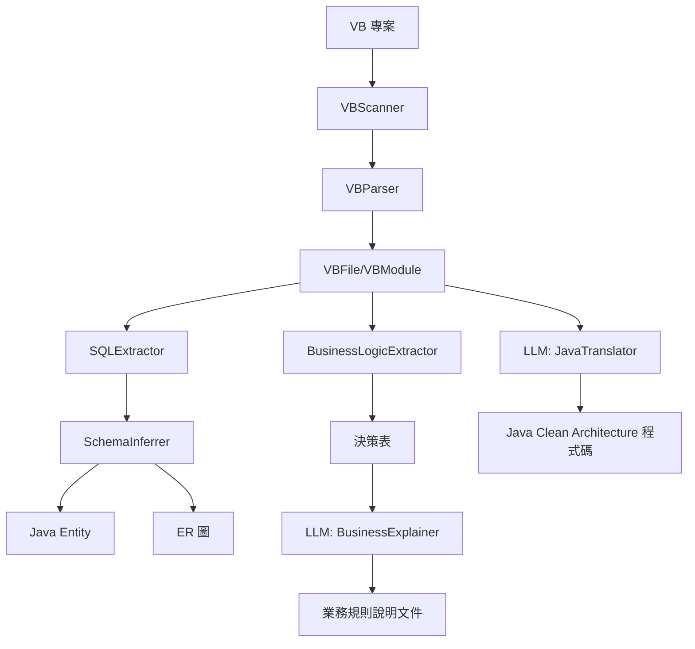

# VB to Java Migration Toolkit - 開發者手冊

> 本手冊供工程師維護和擴展此專案使用

## 目錄

1. [專案概覽](#1-專案概覽)
2. [開發環境設定](#2-開發環境設定)
3. [專案架構](#3-專案架構)
4. [核心模組說明](#4-核心模組說明)
5. [LLM 整合規範](#5-llm-整合規範)
6. [擴展指南](#6-擴展指南)
7. [測試指南](#7-測試指南)
8. [常見問題](#8-常見問題)

---

## 1. 專案概覽

### 目的
將 VB6 專案遷移至 Java Clean Architecture，透過 AI 輔助萃取業務邏輯並轉譯程式碼。

### 核心功能
- **VB 程式碼解析** - 解析 .cls, .bas, .frm 檔案結構
- **SQL/Schema 萃取** - 從程式碼中識別資料庫結構
- **業務邏輯萃取** - 提取決策邏輯、計算公式、驗證規則
- **LLM 輔助分析** - 使用 AI 解讀業務規則並生成 Java 程式碼

---

## 2. 開發環境設定

### 系統需求
- Python 3.11+
- Poetry（套件管理）

### 安裝步驟

```bash
# 1. Clone 專案
cd vb-to-java-toolkit

# 2. 安裝依賴
poetry install

# 3. 設定環境變數（LLM 功能需要）
cp .env.example .env
# 編輯 .env 設定 OPENAI_API_KEY

# 4. 執行測試
poetry run python run_test.py
```

### 環境變數

| 變數名稱 | 用途 | 必要 |
|----------|------|------|
| `OPENAI_API_KEY` | OpenAI API 金鑰 | LLM 功能必要 |
| `LLM_BASE_URL` | API Endpoint（預設 https://api.openai.com/v1） | 必要 |
| `LLM_MODEL` | 模型名稱（預設 gpt-4o-mini） | 可選 |

---

## 3. 專案架構

```
vb-to-java-toolkit/
├── src/
│   ├── __init__.py
│   ├── analyzer.py          # 主控分析器
│   ├── config/
│   │   └── settings.py      # 應用程式設定
│   ├── parsers/              # VB 程式碼解析
│   │   ├── models.py        # 資料模型
│   │   ├── vb_scanner.py    # 檔案掃描器
│   │   └── vb_parser.py     # 程式碼解析器
│   ├── extractors/           # 資訊萃取
│   │   ├── sql_extractor.py          # SQL 萃取
│   │   ├── schema_inferrer.py        # Schema 推斷
│   │   └── business_logic_extractor.py # 業務邏輯萃取
│   ├── llm/                  # LLM 整合
│   │   ├── llm_client.py    # LLM Client (SSE)
│   │   ├── business_explainer.py  # 業務解說器
│   │   └── java_translator.py     # Java 轉譯器
│   ├── generators/           # 程式碼生成（待開發）
│   ├── verifiers/            # 行為驗證（待開發）
│   └── api/                  # API 端點（待開發）
├── examples/
│   └── sample-erp/          # 測試用 VB 範例
├── output/                   # 分析輸出目錄
├── run_test.py              # 基本功能測試
├── test_llm.py              # LLM 功能測試
└── pyproject.toml           # Poetry 設定
```

---

## 4. 核心模組說明

### 4.1 VB 解析器 (`src/parsers/`)

#### 資料模型 (`models.py`)

```python
# 主要類別
VBFile       # 代表一個 VB 檔案
VBModule     # 代表解析後的模組
VBFunction   # 函數/子程序
VBVariable   # 變數
VBProperty   # 屬性存取器
```

#### 掃描器 (`vb_scanner.py`)

```python
from src.parsers import VBScanner

scanner = VBScanner("/path/to/vb/project")
vb_files = scanner.scan(recursive=True)  # 掃描所有 VB 檔案

# 支援的副檔名
# .cls (類別), .bas (模組), .frm (表單)
```

#### 解析器 (`vb_parser.py`)

```python
from src.parsers import VBParser

parser = VBParser()
for vb_file in vb_files:
    parser.parse(vb_file)  # 解析並填充 vb_file.module
```

### 4.2 萃取器 (`src/extractors/`)

#### SQL 萃取器 (`sql_extractor.py`)

```python
from src.extractors import SQLExtractor

extractor = SQLExtractor()
sqls = extractor.extract_from_code(
    code=func.body,
    source_file="Customer.cls",
    source_function="LoadFromDB"
)

# 萃取結果
extractor.tables   # Dict[str, ExtractedTable]
extractor.columns  # Dict[str, ExtractedColumn]
```

#### Schema 推斷器 (`schema_inferrer.py`)

```python
from src.extractors import SchemaInferrer

inferrer = SchemaInferrer()
inferrer.process_sql_extractor_results(sql_extractor)
inferrer.infer_additional_types()

# 輸出
inferrer.export_json("schema.json")
inferrer.generate_mermaid_erd()      # Mermaid ER 圖
inferrer.generate_java_entities()    # Java Entity 程式碼
```

#### 業務邏輯萃取器 (`business_logic_extractor.py`)

```python
from src.extractors import BusinessLogicExtractor

ble = BusinessLogicExtractor()
rules = ble.extract_from_function(
    func_name="CalculateDiscount",
    func_body=func.body,
    source_file="Customer.cls"
)

# 每條規則包含
rule.name             # 規則名稱
rule.rule_type        # DECISION / CALCULATION / VALIDATION
rule.decision_table   # 決策表
rule.pseudocode       # 偽代碼
```

### 4.3 主控分析器 (`src/analyzer.py`)

```python
from src.analyzer import analyze_project

# 一鍵分析
results = analyze_project(
    project_path="/path/to/vb/project",
    output_dir="/path/to/output",
    recursive=True
)

# 或使用 Class 形式
analyzer = VBProjectAnalyzer("/path/to/vb/project")
analyzer.analyze()
analyzer.export_results("/path/to/output")
analyzer.print_summary()
```

---

## 5. LLM 整合規範

> [!CAUTION]
> **公司強制規範 - 絕對不可例外！**

### ⚠️ 嚴格規範（違反即為 BUG）

| 規範 | 說明 | 違反處置 |
|------|------|----------|
| **stream=True** | 所有 LLM 呼叫必須使用 SSE Streaming | 程式碼審查不通過 |
| **Message 格式** | 只能用 `[System, User]` 兩種角色 | 禁止使用 Assistant/Tool 角色 |
| **OpenAI SDK** | 必須使用 `openai` 套件 | 禁止使用其他 HTTP Client |

### LLM Client 內部實作（已強制 stream=True）

```python
# src/llm/llm_client.py 內部實作
# ⚠️ stream=True 是寫死的，無法關閉！

async def generate(self, user_prompt: str, system_prompt: str, ...):
    messages = [
        {"role": "system", "content": system_prompt},  # 只有 System
        {"role": "user", "content": user_prompt},      # 只有 User
    ]
    
    # 🔒 強制 SSE Streaming - 不可更改
    stream = await self.client.chat.completions.create(
        model=self.config.model,
        messages=messages,
        stream=True,  # ← 強制 True，這是公司規定！
    )
    
    # 必須使用 async for 處理 SSE 串流
    async for chunk in stream:
        ...
```

### 使用方式

```python
from src.llm import create_llm_client

# 建立 Client（內部已強制 stream=True）
llm = create_llm_client(
    api_key="your_api_key",
    base_url="https://api.openai.com/v1",
    model="gpt-4o-mini"
)

# 呼叫時會自動使用 SSE Streaming
# on_chunk 回調可接收即時串流內容
response = await llm.generate(
    system_prompt="你是一位分析師...",
    user_prompt="請分析以下程式碼...",
    on_chunk=lambda chunk: print(chunk, end="", flush=True)
)

# 或使用 AsyncGenerator 形式取得串流
async for chunk in llm.generate_stream(system_prompt, user_prompt):
    print(chunk, end="", flush=True)
```

> [!WARNING]
> **禁止的用法（會導致程式碼審查不通過）：**
> - ❌ 直接使用 `openai.ChatCompletion.create()` 且 `stream=False`
> - ❌ 使用 `requests` 或 `httpx` 直接呼叫 API
> - ❌ 使用 Assistant 或 Tool 角色的 message

### 業務邏輯解說器

```python
from src.llm import BusinessLogicExplainer

explainer = BusinessLogicExplainer(llm_client)

# 解說單一規則
result = await explainer.explain_rule(rule, on_chunk=print)

# 批次解說
results = await explainer.explain_rules_batch(
    rules,
    on_progress=lambda cur, total, name: print(f"{cur}/{total}: {name}")
)

# 匯出 Markdown
markdown = explainer.export_explanations_markdown()
```

### Java 轉譯器

```python
from src.llm import JavaCodeTranslator, JavaLayer

translator = JavaCodeTranslator(llm_client)

# 轉譯函數到 Use Case 層
result = await translator.translate_function(
    vb_code=func.body,
    function_name="CalculateDiscount",
    target_layer=JavaLayer.USE_CASE,
    context="這是會員折扣計算邏輯",
    on_chunk=print
)

# 轉譯類別到 Entity
result = await translator.translate_to_entity(
    vb_class_code=class_code,
    class_name="Customer",
    inferred_columns=schema_inferrer.tables["Customers"].columns
)
```

---

## 6. 擴展指南

### 新增萃取器

1. 在 `src/extractors/` 建立新檔案
2. 繼承或參考 `SQLExtractor` 的模式
3. 在 `__init__.py` 中匯出

```python
# src/extractors/my_extractor.py
class MyExtractor:
    def extract_from_code(self, code: str) -> List[MyResult]:
        ...
```

### 新增 LLM 功能

1. 在 `src/llm/` 建立新檔案
2. 接收 `LLMClient` 作為依賴
3. **必須使用 SSE Streaming**

```python
# src/llm/my_analyzer.py
class MyAnalyzer:
    def __init__(self, llm_client: LLMClient):
        self.llm_client = llm_client
    
    async def analyze(self, data: str) -> str:
        # 必須使用 stream=True（LLMClient 已強制）
        return await self.llm_client.generate(
            system_prompt="...",
            user_prompt=data
        )
```

### 新增解析器

1. 在 `src/parsers/` 建立新檔案
2. 使用 `models.py` 中的資料模型
3. 考慮編碼問題（VB 可能使用 Big5/GB2312）

---

## 7. 測試指南

### 執行基本測試

```bash
# 測試解析和萃取功能（不需 API Key）
poetry run python run_test.py
```

### 執行 LLM 測試

```bash
# 需要設定 OPENAI_API_KEY
export OPENAI_API_KEY=your_key
poetry run python test_llm.py
```

### 新增測試資料

在 `examples/` 目錄下新增 VB 檔案：

```
examples/
└── my-test-project/
    ├── MyClass.cls
    ├── MyModule.bas
    └── README.md
```

---

## 8. 常見問題

### Q: 編碼問題怎麼處理？

`VBScanner` 使用 `chardet` 自動偵測編碼，支援 UTF-8、Big5、GB2312、CP1252 等。

### Q: 如何處理大型專案？

建議分批處理：
```python
scanner = VBScanner("/large/project")
files = scanner.scan()

# 分批處理
batch_size = 50
for i in range(0, len(files), batch_size):
    batch = files[i:i+batch_size]
    # 處理這批檔案
```

### Q: LLM 回應不完整？

檢查 `max_tokens` 設定：
```python
config = LLMConfig(
    api_key=key,
    max_tokens=8000  # 增加限制
)
```

---

## 附錄：資料流程圖



---

*最後更新：2026-01-31*
